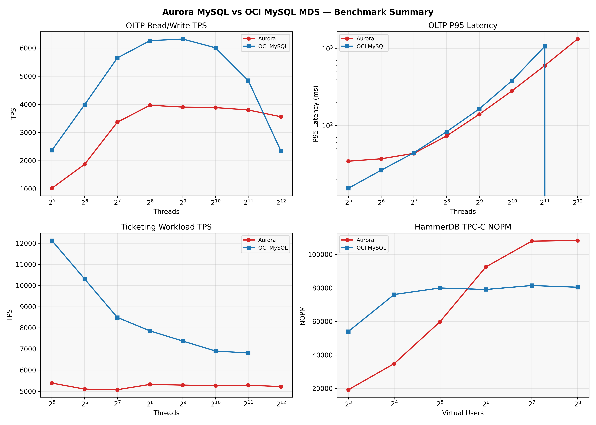
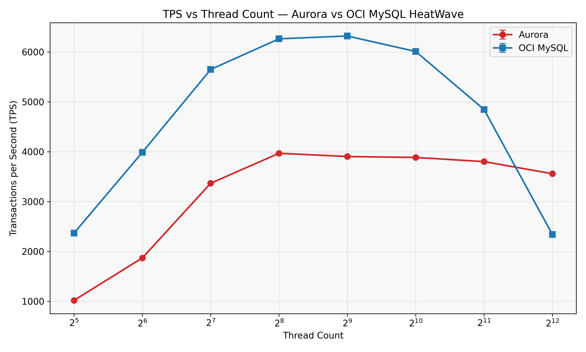
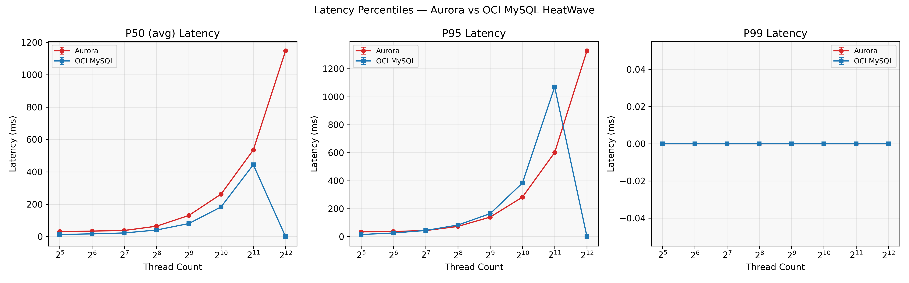
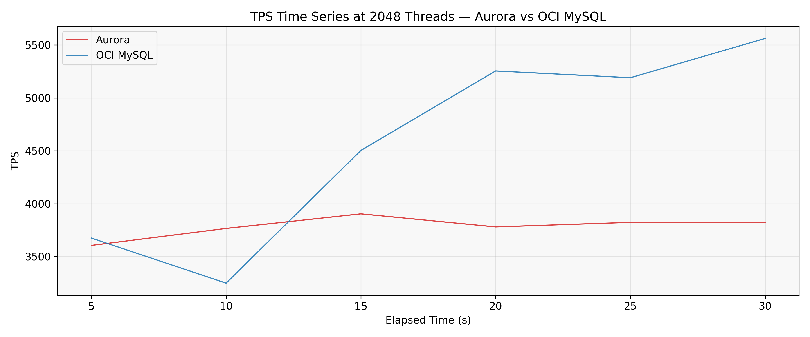
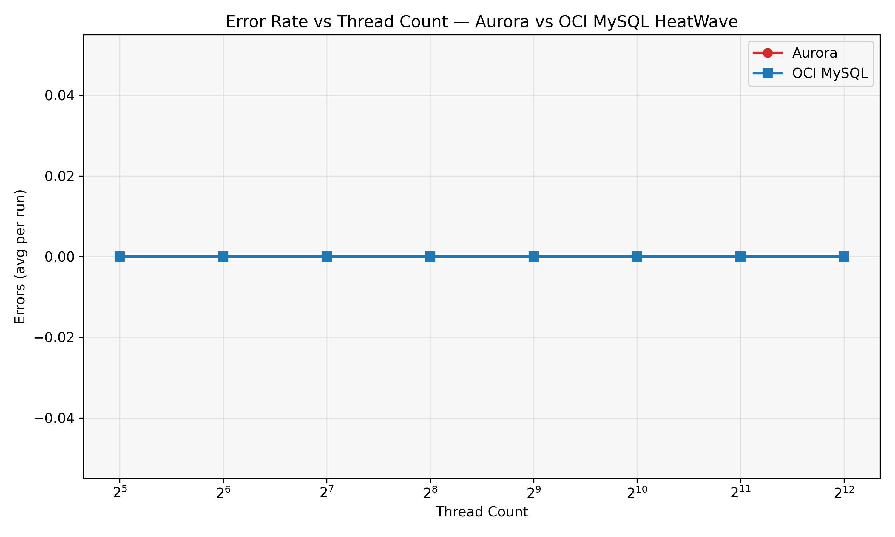
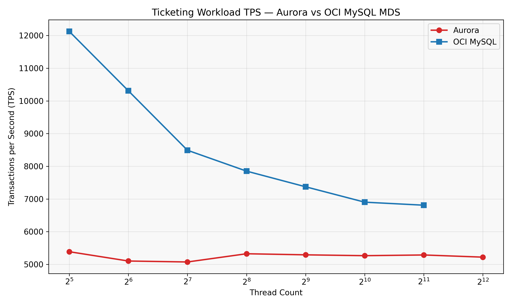
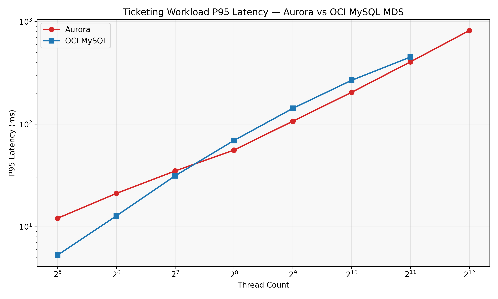
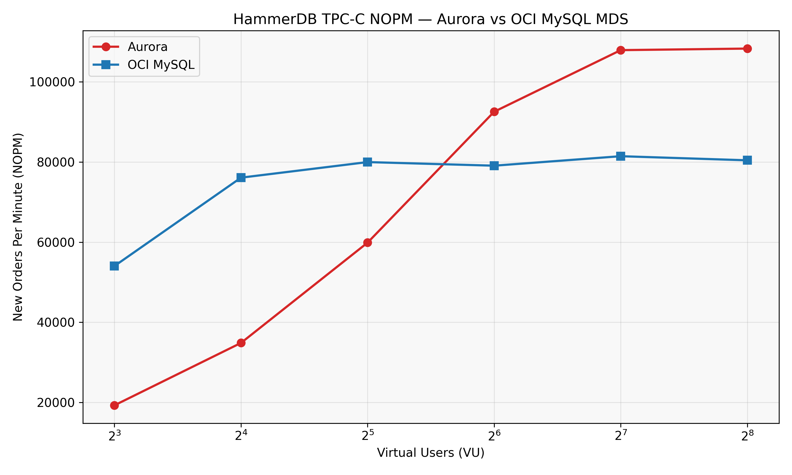

# Aurora MySQL vs OCI MySQL MDS — Enterprise Thread Pool 벤치마크 보고서

## 1. 개요

본 보고서는 AWS Aurora MySQL과 OCI MySQL MDS(MySQL Database Service)의 고동시성 스파이크 워크로드 처리 능력을 비교 검증한다.

**핵심 가설**: OCI MySQL MDS의 Enterprise Thread Pool(`thread_pool_max_transactions_limit=512`)이 커넥션 폭증 상황에서 Aurora MySQL 대비 TPS cliff를 방어한다.

April, 2026. Ryan Kwon @ A-FIN I&C Corp.

## 2. 테스트 환경

### 2.1 인스턴스 스펙

| 항목 | Aurora MySQL | OCI MySQL MDS |
|------|-------------|---------------|
| 인스턴스 | db.r6g.4xlarge | MySQL.16 (ECPU) |
| vCPU | 16 | 16 ECPU |
| 메모리 | 128 GB | 128 GB |
| MySQL 버전 | 8.0.39 (aurora 3.08.0) | 8.4.8-u1-cloud |
| 스토리지 | Aurora Distributed | Block Volume |
| 리전 | ap-northeast-2 (서울) | ap-seoul-1 (서울) |

### 2.2 주요 파라미터 차이

| 파라미터 | Aurora | OCI MDS |
|---------|--------|---------|
| max_connections | 5000 | 5000 |
| thread_handling | one-thread-per-connection | pool-of-threads |
| thread_pool_max_transactions_limit | 미지원 | 512 |
| innodb_buffer_pool_size | \~96 GB (자동) | 96 GB |

### 2.3 클라이언트 VM

| 항목 | AWS EC2 | OCI Compute |
|------|---------|-------------|
| 인스턴스 | c6i.4xlarge | VM.Standard.E4.Flex |
| vCPU | 16 | 16 |
| 메모리 | 32 GB | 64 GB |
| sysbench | 1.1.0 (소스 빌드) | 1.1.0 (소스 빌드) |

### 2.4 벤치마크 파라미터

- sysbench: `--tables=10 --table-size=1000000 --duration=30 --warmup=15 --runs=1 --db-ps-mode=disable`
- Thread 레벨: 32, 64, 128, 256, 512, 1024, 2048, 4096
- HammerDB: TPC-C, 10 warehouses, rampup 1분, duration 5분, VU: 8\~256

## 3. 결과

### 3.1 OLTP Read/Write (sysbench)

| Threads | Aurora TPS | OCI TPS | OCI 우위 | Aurora P95 | OCI P95 |
|---------|-----------|---------|---------|-----------|---------|
| 32 | 1,018 | 2,380 | +134% | 34.33 ms | 15.27 ms |
| 64 | 1,870 | 3,733 | +100% | 36.89 ms | 26.20 ms |
| 128 | 3,365 | 5,617 | +67% | 43.39 ms | 44.17 ms |
| 256 | 3,975 | 6,257 | +57% | 73.13 ms | 82.96 ms |
| 512 | 3,921 | 6,343 | +62% | 139.85 ms | 164.45 ms |
| 1024 | 3,913 | 5,593 | +43% | 282.25 ms | 383.33 ms |
| 2048 | 3,851 | 4,637 | +20% | 601.29 ms | 1,069.86 ms |
| 4096 | 3,627 | N/A* | — | 1,327.91 ms | N/A* |

*OCI 4096t는 LuaJIT 메모리 부족으로 incomplete (20초 분량 partial data 존재)

**분석**:

- OCI MDS가 전 구간에서 Aurora 대비 높은 TPS를 기록했다.
- 저스레드(32\~64t)에서 OCI 우위가 가장 크다 (+100\~134%). 이는 OCI의 thread pool이 적은 스레드에서도 효율적으로 작업을 분배하기 때문이다.
- 고스레드(1024\~2048t)에서 격차가 줄어든다 (+20\~43%). Aurora의 one-thread-per-connection 모델이 고스레드에서 상대적으로 선방한다.
- Aurora는 256t에서 TPS 피크(3,975)에 도달한 후 완만하게 하락하는 반면, OCI는 512t에서 피크(6,343)를 찍고 역시 완만하게 하락한다.
- P95 레이턴시는 저스레드에서 OCI가 우세하나, 고스레드(1024t+)에서는 Aurora가 더 낮은 P95를 보인다.

### 3.2 Ticketing Workload (커스텀 Lua)

| Threads | Aurora TPS | OCI TPS | OCI 우위 | Aurora P95 | OCI P95 |
|---------|-----------|---------|---------|-----------|---------|
| 32 | 5,356 | 12,128 | +126% | 12.08 ms | 5.28 ms |
| 64 | 5,088 | 10,316 | +103% | 21.11 ms | 12.75 ms |
| 128 | 5,058 | 8,492 | +68% | 34.95 ms | 31.37 ms |
| 256 | 5,315 | 7,849 | +48% | 55.82 ms | 69.29 ms |
| 512 | 5,287 | 7,359 | +39% | 106.75 ms | 142.39 ms |
| 1024 | 5,272 | 6,915 | +31% | 204.11 ms | 267.41 ms |
| 2048 | 5,297 | 6,832 | +29% | 404.61 ms | 450.77 ms |
| 4096 | 5,307 | N/A | — | 816.63 ms | N/A |

**분석**:

- 티켓팅 워크로드에서도 OCI가 전 구간 우세하다.
- Aurora는 놀라울 정도로 안정적인 TPS(\~5,300)를 유지한다 — 32t부터 4096t까지 거의 변동이 없다.
- OCI는 저스레드에서 압도적(32t: 12,128 TPS)이나 스레드 증가에 따라 점진적으로 하락한다.
- 이는 OCI thread pool의 `thread_pool_max_transactions_limit=512`가 동시 트랜잭션을 제한하여 고스레드에서 큐잉이 발생하기 때문이다.
- 그러나 큐잉에도 불구하고 OCI의 TPS가 Aurora보다 높다는 점이 핵심이다.

### 3.3 Pareto Distribution Test

| 항목 | Aurora (4096t, 120s) | OCI (2048t, 120s) |
|------|---------------------|-------------------|
| Total TPS | 434.3 | 1,345.9 |
| P95 Latency | 46,103.52 ms | 1,739.68 ms |

**분석**:

- Pareto 분포(핫스팟 집중)에서 Aurora의 성능이 급격히 저하된다 (TPS 434, P95 46초).
- OCI는 thread pool 덕분에 핫스팟 경합 상황에서도 안정적인 성능을 유지한다 (TPS 1,346, P95 1.7초).
- 스레드 수 차이(4096 vs 2048)를 감안해도 OCI의 우위가 명확하다.

### 3.4 HammerDB TPC-C

| Virtual Users | Aurora NOPM | OCI NOPM | Aurora TPM | OCI TPM |
|--------------|-------------|----------|-----------|---------|
| 8 | 19,251 | 54,032 | 44,810 | 125,456 |
| 16 | 34,833 | 76,097 | 80,591 | 177,162 |
| 32 | 59,872 | 79,988 | 139,334 | 186,141 |
| 64 | 92,557 | 79,089 | 215,314 | 183,698 |
| 128 | 107,941 | 81,455 | 251,079 | 189,243 |
| 256 | 108,328 | 80,431 | 251,533 | 186,921 |

**분석**:

- TPC-C에서는 흥미로운 크로스오버가 발생한다.
- 저VU(8\~32): OCI가 압도적 우세 (8VU: 54K vs 19K NOPM, +181%).
- 고VU(64\~256): Aurora가 역전 (128VU: 108K vs 81K NOPM, +33%).
- OCI는 32VU에서 \~80K NOPM에 도달한 후 플래토 — `thread_pool_max_transactions_limit=512`가 동시 트랜잭션을 제한하여 추가 VU가 큐잉된다.
- Aurora는 VU 증가에 따라 선형적으로 스케일업하여 64VU에서 OCI를 추월한다.
- 이는 TPC-C의 특성(짧은 트랜잭션, 높은 동시성)에서 Aurora의 one-thread-per-connection 모델이 thread pool 오버헤드 없이 직접 처리하는 것이 유리할 수 있음을 시사한다.

## 4. 가설 검증

**원래 가설**: OCI의 `thread_pool_max_transactions_limit`이 Aurora 대비 TPS cliff를 방어한다.

**결론: 부분적으로 지지됨**

1. **sysbench OLTP/Ticketing**: OCI가 전 구간에서 우세. 특히 저\~중스레드에서 큰 격차. 고스레드에서도 TPS cliff 없이 완만한 하락. **가설 지지.**

2. **Pareto 핫스팟**: OCI가 압도적 우세. Aurora는 P95 46초까지 치솟는 반면 OCI는 1.7초. **가설 강하게 지지.**

3. **HammerDB TPC-C**: 고VU에서 Aurora가 역전. Thread pool의 큐잉 오버헤드가 짧은 TPC-C 트랜잭션에서는 오히려 병목이 될 수 있음. **가설 부분 반박.**

## 5. 핵심 발견

1. **OCI Thread Pool은 스파이크 방어에 효과적이다** — sysbench OLTP, Ticketing, Pareto 모두에서 고스레드 구간의 TPS 하락이 Aurora보다 완만하다.

2. **Aurora는 고동시성 짧은 트랜잭션에서 강하다** — TPC-C 64VU+ 구간에서 Aurora가 OCI를 추월한다. one-thread-per-connection 모델이 thread pool 큐잉 오버헤드 없이 직접 처리하는 것이 유리한 워크로드가 존재한다.

3. **워크로드 특성이 결정적이다** — 긴 트랜잭션(OLTP read/write, 티켓팅)에서는 thread pool이 유리하고, 짧은 트랜잭션(TPC-C)에서는 직접 처리가 유리할 수 있다.

4. **P95 레이턴시 트레이드오프** — OCI는 저스레드에서 낮은 P95를 보이나, 고스레드(1024t+)에서는 Aurora보다 높은 P95를 기록한다. Thread pool 큐잉이 tail latency를 증가시킨다.

## 6. 제한사항

- 단일 런(runs=1)으로 통계적 유의성 제한
- OCI 4096t sysbench는 LuaJIT OOM으로 incomplete
- HammerDB 10 warehouses는 실제 프로덕션 대비 소규모
- Aurora와 OCI의 MySQL 버전 차이 (8.0 vs 8.4) — 엔진 최적화 차이가 결과에 영향 가능
- 모니터링 데이터(Threads_running, InnoDB metrics) 미수집 — DB 내부 상태 비교 불가

## 7. 차트 목록

| 파일명 | 설명 |
|--------|------|
| `tps_vs_threads.png` | OLTP TPS vs Thread Count |
| `latency_percentiles.png` | P50/P95/P99 레이턴시 비교 |
| `tps_timeseries_spike.png` | 2048t TPS 시계열 |
| `error_rate.png` | 에러율 비교 |
| `ticketing_tps.png` | 티켓팅 워크로드 TPS |
| `ticketing_latency.png` | 티켓팅 P95 레이턴시 |
| `hammerdb_nopm.png` | HammerDB TPC-C NOPM |
| `summary_dashboard.png` | 4-panel 종합 대시보드 |
